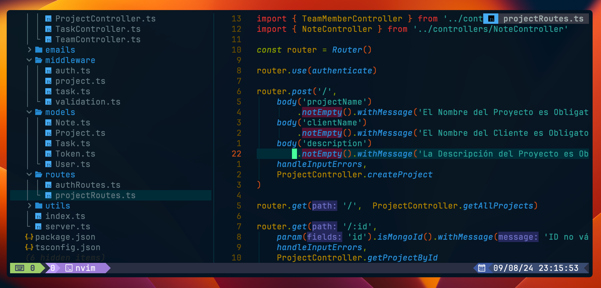

# Backend Directories 📁


#### Some information:

##### 👾 [TypeScript](https://www.typescriptlang.org/):

> **Description**: TypeScript is a statically typed superset of JavaScript that compiles to plain JavaScript. It adds type safety and other features.

> **Why It's Used**: TypeScript improves code quality and maintainability by providing static typing, which helps catch errors during development and enables better tooling support.

##### 🗒️ [ts-node](https://typestrong.org/ts-node/):

> **Description**: ts-node is a TypeScript execution engine that allows you to run TypeScript files directly without pre-compiling them.

> **Why It's Used**: During development, ts-node simplifies running TypeScript code by avoiding the need to manually compile TypeScript files to JavaScript.

##### 💻 [cors](https://github.com/expressjs/cors):

> **Description**: CORS (Cross-Origin Resource Sharing) is a middleware that allows servers to specify which origins are permitted to access resources.

> **Version**: ^2.8.5

> **Why It's Used**: CORS middleware is crucial for enabling cross-origin requests, which is necessary for modern web applications that make requests to different domains.

##### [express-validator](https://express-validator.github.io/docs/)

> **Description**: Express-validator is a set of middleware for validating and sanitizing user inputs in Express applications.

> **Version**: ^7.0.1

> **Why It's Used**: This package helps validate and sanitize user input, ensuring that incoming data meets expected formats and preventing common security vulnerabilities.

##### [jsonwebtoken](https://github.com/auth0/node-jsonwebtoken)

> **Description**: JSON Web Token (JWT) is a compact, URL-safe means of representing claims between two parties. It is used for authentication and authorization.

> **Version**: ^9.0.2

> **Why It's Used**: JWT is used for secure token-based authentication, allowing users to authenticate and authorize requests in a stateless manner.

# 🔭 Requirements

#### Before you begin, make sure you have the following installed on your system:

> **Node.js**: Version 16.x or higher (LTS version is recommended).

> **npm**: Included with Node.js.

# 📦 Installation.

### Follow these steps to set up and run the project:

1. **Clone the repository and navigate to the project directory**:

```bash
   git clone git@github.com:craftxdog/UptaskManagerBackend.git && cd UptaskManagerBackend
```

2. **Install project dependencies**:

```bash
   npm install
```

3. **Run the development server (optional)**:

```bash
   npm run dev
```

# ⚙️ Configuration


# 🎛️ Routes


