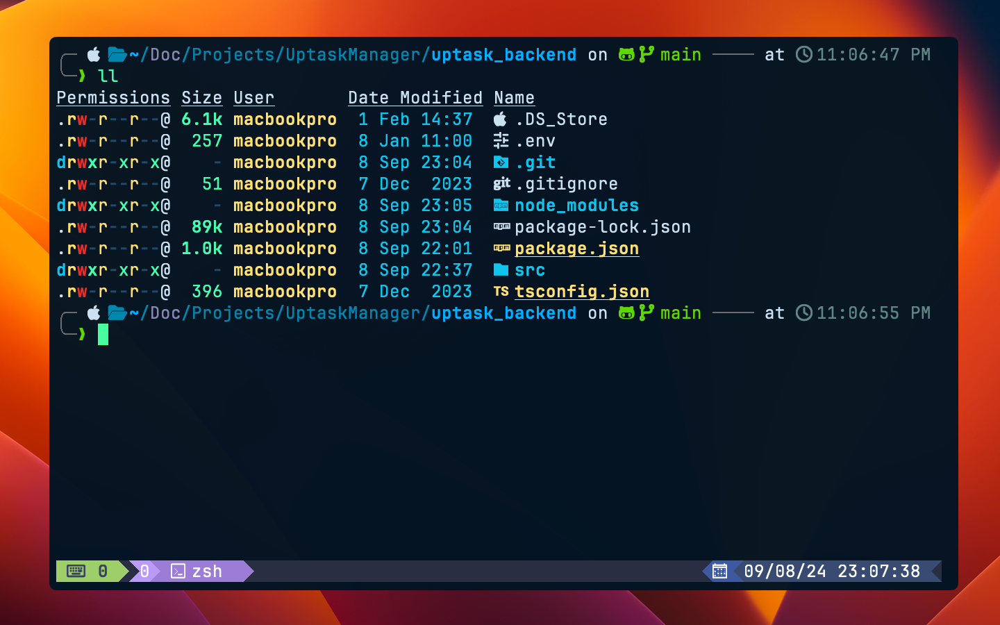
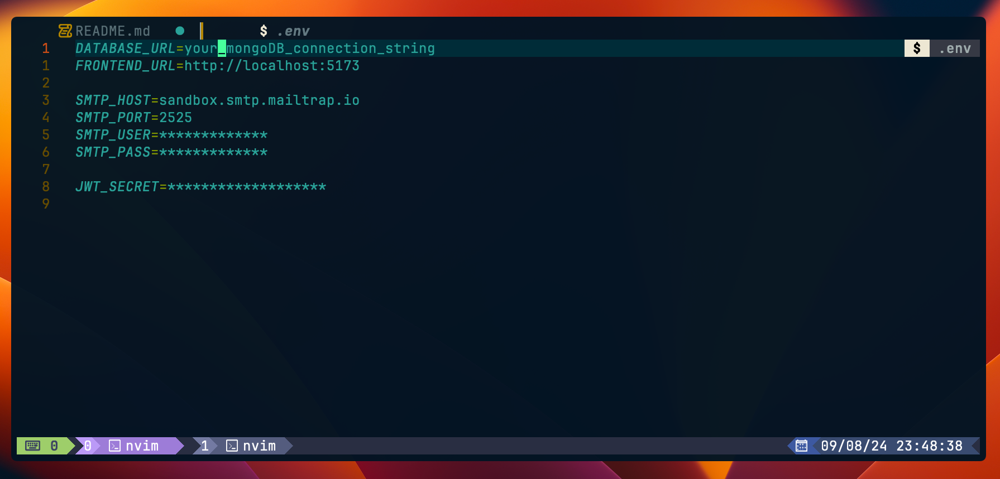

# Backend Directories 📁



# 🔭 Requirements

#### Before you begin, make sure you have the following installed on your system:

> **Node.js**: Version 16.x or higher (LTS version is recommended).

> **npm**: Included with Node.js.

# 📦 Installation.

#### Follow these steps to set up and run the project:

1. **Clone the repository and navigate to the project directory**:

```bash
   git clone git@github.com:craftxdog/UptaskManagerBackend.git && cd UptaskManagerBackend
```

# ⚙️ Configuration


